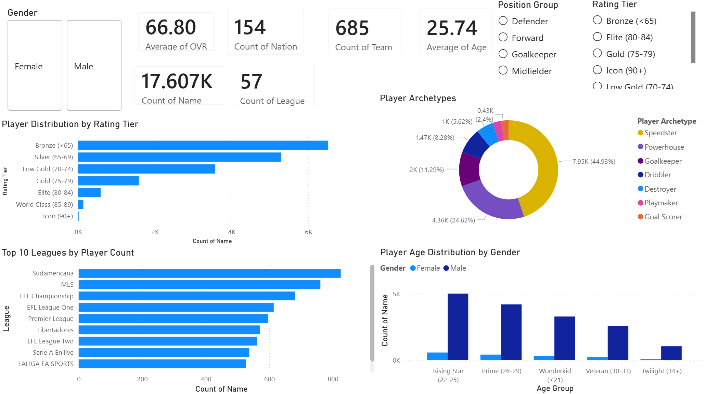
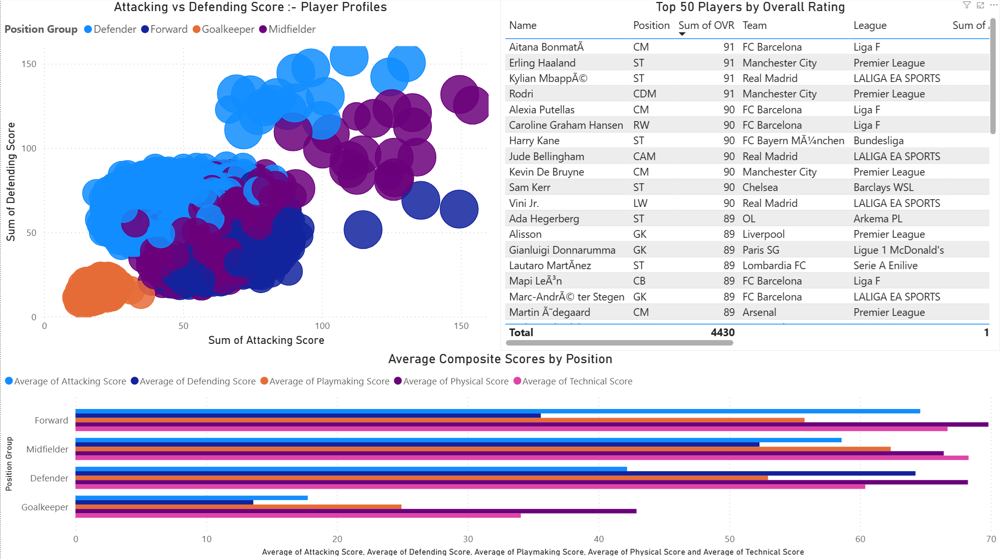
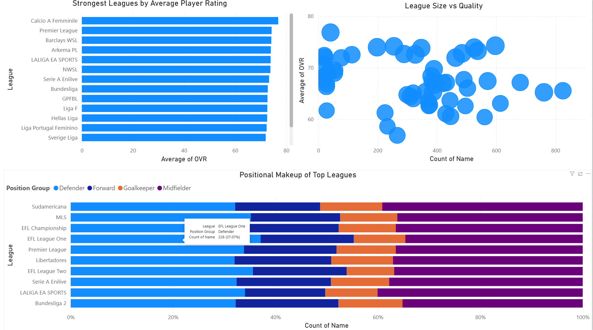
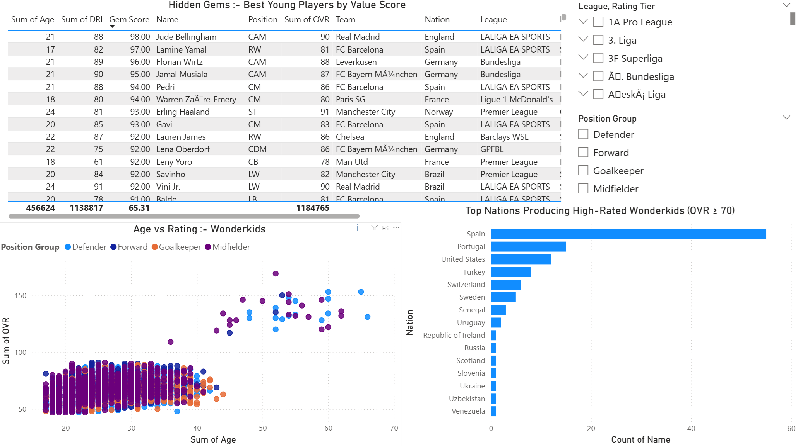

# ⚽ EA FC 25 PLAYER INTELLIGENCE DASHBOARD

An interactive Power BI dashboard analyzing **17,607 players** across 57 leagues and 154 nations, featuring player scouting tools, league intelligence, composite skill scores and a Hidden Gems finder for discovering undervalued wonderkids.



## PROJECT OVERVIEW

EA FC 25's database contains detailed attributes for every professional football player in the game. This dashboard transforms that data into an interactive scouting and intelligence platform that answers the questions coaches, scouts and analysts care about:

- Which players offer the best value for their age and rating?
- How do the top leagues compare in quality and positional makeup?
- What does the attacking vs defending profile look like across positions?
- Where are the next generation of superstars coming from?

## KEY FINDINGS

### Player Landscape
- **17,607 players** across the male and female game, with an average OVR of **66.80** and average age of **25.74**
- The rating pyramid is steep: **6,535 Bronze-rated players** form the base, while only **11 players reach Icon status (90+)** headlined by Aitana Bonmati, Haaland, Mbappe and Rodri all at 91 OVR
- **Speedsters dominate** the archetype distribution at **44.93%**, followed by Powerhouses at **24.62%** reflecting EA's tendency to differentiate players through pace, the most impactful attribute in gameplay
- The **Rising Star (22-25)** age group is the largest cohort with ~5,600 players, while **Twilight (34+)** players are rare, reflecting real football's youth-focused transfer market

### The Elite Tier
- The Top 50 is remarkably diverse where **both men's and women's players** appear at the highest ratings, with FC Barcelona's women's team heavily represented (Bonmati, Putellas, Graham Hansen, Mapi Leon)
- **FC Barcelona** dominates the elite tier across both genders, appearing more than any other club in the Top 50
- The scatter plot reveals a clear positional separation: **Forwards cluster high on attacking score**, **Defenders cluster high on defending score**, while **Midfielders spread across the middle** validating EA's attribute system accurately reflects real-world roles

### Composite Score Insights
- **Forwards** lead in attacking and technical scores but trail significantly in defending
- **Defenders** have the most balanced profile with moderate scores across all five composites
- **Goalkeepers** naturally score lowest across outfield metrics, confirming the data model correctly isolates their unique attribute set
- **Midfielders** are the most well-rounded position group, with competitive scores in all five areas

### League Intelligence
- **Calcio A Femminile** (Italian women's league) tops the average OVR ranking as a small league with concentrated talent
- Among men's leagues, **Premier League** leads in average quality, followed by **LALIGA EA SPORTS** and **Serie A**
- The League Size vs Quality scatter reveals a clear insight: **smaller, elite leagues** (top-left cluster) have higher average OVR, while **larger leagues** (Sudamericana, MLS with 800+ players) have lower averages diluted by squad depth
- All top leagues maintain a roughly consistent positional split: ~35% Defenders, ~25% Midfielders, ~20% Forwards, ~20% Goalkeepers

### Hidden Gems — The Next Generation
- **Jude Bellingham** (21, OVR 90, Real Madrid) tops the Gem Score at 98 with the perfect combination of youth and elite rating
- **Lamine Yamal** (17, OVR 81) is the youngest player in the high-rated tier, making him statistically the highest-potential wonderkid in the game
- **Spain dominates wonderkid production** with nearly 60 high-rated players under 21 which is more than triple any other nation. Portugal and the United States follow distantly
- The Age vs Rating scatter shows a clear "wonderkid ceiling" around OVR 85, with only Bellingham breaking through to 90+ before age 22



## DASHBOARD PAGES

### Page 1: Overview
KPI cards, rating tier distribution, player archetypes donut, top 10 leagues, age distribution by gender, interactive slicers for gender/position/tier

### Page 2: Player Scout
Attacking vs Defending scatter plot by position, Top 50 players table, composite scores by position group, league/nation/age slicers

### Page 3: League Analysis
Strongest leagues by average OVR, league size vs quality scatter, positional makeup of top leagues (100% stacked bar)

### Page 4: Hidden Gems
Gem Score table ranking young players by value, age vs rating scatter plot, top nations producing wonderkids (OVR ≥ 70, age ≤ 21)




## TOOLS AND TECHNOLOGIES

- **Power BI Desktop** - an interactive dashboard development
- **DAX** - Gem Score measure, calculated aggregations
- **Power Query** - data loading and type configuration
- **Python / pandas** - data preparation, composite score calculation, player archetype classification
- **Kaggle** - EA FC 25 player dataset

### Power BI Skills Demonstrated
- Multi-page interactive dashboards with cross-filtering
- DAX measures with arithmetic formulas
- Scatter plots with multi-dimensional encoding (position, size, color)
- Top N visual-level filtering
- Advanced visual-level filters (age group + OVR threshold combination)
- 100% stacked bar charts for composition analysis
- Interactive slicers with dropdown formatting

## PROJECT STRUCTURE

```
fifa-player-intelligence-dashboard/
├── data/
│   ├── male_players.csv               # EA FC 25 male player data
│   ├── female_players.csv             # EA FC 25 female player data
│   └── fc25_powerbi_ready.csv         # Enriched combined dataset
├── powerbi/
│   └── FC25_Player_Intelligence.pbix  # Power BI dashboard
├── scripts/
│   └── prepare_data.py                # Data prep with composite scores
├── images/                            # Dashboard screenshots
└── README.md
```

## GETTING STARTED

### Prerequisites
- Power BI Desktop
- Python 3.10+

### Setup
```bash
git clone https://github.com/rush2pranav/fifa-player-intelligence-dashboard.git
cd fifa-player-intelligence-dashboard

pip install pandas numpy
python scripts/prepare_data.py

# Open powerbi/FC25_Player_Intelligence.pbix in Power BI Desktop
```

### Dataset
Download from [Kaggle — EA FC 25 Database](https://www.kaggle.com/datasets/nyagami/ea-sports-fc-25-database-ratings-and-stats) and place CSV files in `data/`.

## WHAT I LEARNED

- **Composite scores add analytical depth** Raw attributes like "Finishing: 85" are hard to compare across positions, but combining them into an "Attacking Score" makes cross-positional analysis meaningful and reveals patterns invisible in individual stats.
- **The Gem Score formula shows the power of custom DAX measures** A simple formula (OVR + age bonus) creates a scouting metric that immediately surfaces interesting players. In a real studio, these kinds of custom KPIs drive game mode features like Career Mode scouting.
- **Visual-level filters are Power BI's secret weapon** Combining an age filter AND an OVR threshold on the wonderkid chart demonstrates a technique that transforms a generic bar chart into a targeted analytical tool.
- **Encoding character issues matter** Special characters in player names (Mbappe, Müller) required Latin-1 encoding handling ie a real-world data engineering challenge that appears in any international dataset.

## POTENTIAL EXTENSIONS

- Add a "Best XI Builder" page where users select formation and see optimal players per position
- Integrate FIFA market value data for cost-efficiency analysis
- Add year-over-year comparison (FC 24 vs FC 25) to track rating changes
- Build a player similarity engine using Euclidean distance on attribute vectors
- Add a "Career Mode Simulator" predicting player growth curves based on age and potential
- Publish to Power BI Service for web access